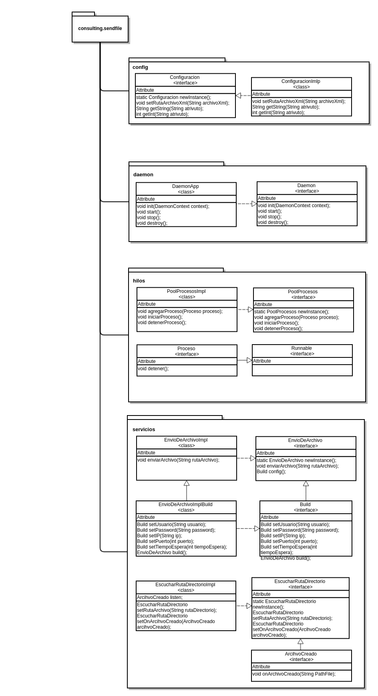
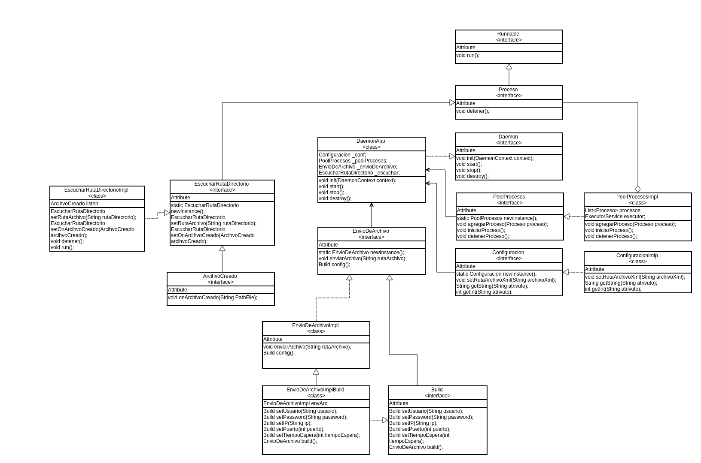
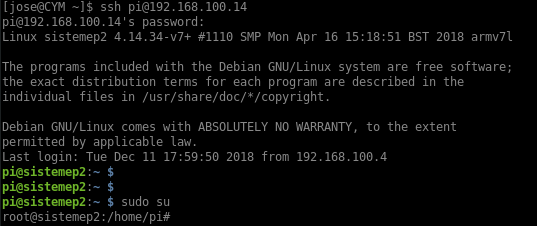

Diseño de aplicacion
==================
Se montrara la arquitectura de paquetes y el diagrama de clases.

Arquitectura de paquetes
==================


Diagrama de clases
==================


Manual de operaciones
==================
Este manual tiene como objetivo, mostrar la arquitectura de carpetas y como solucionar los problemas que puedan ocurrir

## ingrsar al sistemEP
Se tiene que ingresar por el protocolo ssh. Antes de ingresar se debe configurar la red. Por otro lado, recuerda hacer el "sudo su" despues de ingresar.

Ejemplo
```
ssh pi@192.168.100.14
```


## Arquitectura de carpetas.
Este punto muestra como esta clasificado las carpetas en el sistemaEP. <br>
<b>bin:</b> script para ejecutar.<br>
<b>etc:</b> archivos de configuracion. <br>
<b>lib:</b> todas las librerias que se están utilisando. <br>
<b>var:</b> directorio donde esta el log y run. <br>
<b>var/log:</b> aqui se guarda los log del demonio. <br>
<b>var/run:</b> aqui se guarda el fichero pid del demonio. <br>

```
root@sistemep2:/opt# tree daemon-send-file-audio/
daemon-send-file-audio/
├── bin
│   ├── script-iniciar-sistema.sh
│   └── script-run.sh
├── etc
│   ├── log4j.properties
│   └── send-file-audio.xml
├── lib
│   ├── aspectjrt-1.8.4.jar
│   ├── commons-beanutils-1.9.3.jar
│   ├── commons-collections-3.2.2.jar
│   ├── commons-configuration2-2.3.jar
│   ├── commons-daemon-1.1.0.jar
│   ├── commons-lang3-3.7.jar
│   ├── commons-logging-1.2.jar
│   ├── commons-net-3.6.jar
│   ├── daemons-send-file-audio-0.1.0.jar
│   ├── jcabi-aspects-0.22.jar
│   ├── jcabi-log-0.17.2.jar
│   ├── log4j-1.2.17.jar
│   ├── slf4j-api-1.7.5.jar
│   └── validation-api-1.1.0.Final.jar
└── var
    ├── log
    │   ├── daemon-send-file-audio.err
    │   ├── daemon-send-file-audio.log
    │   └── daemon-send-file-audio.out
    └── run
        └── daemon-send-file-audio.pid
```
## iniciar el proceso

